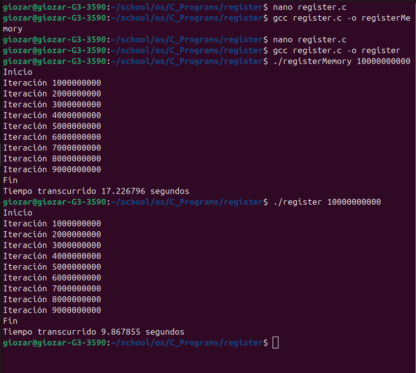
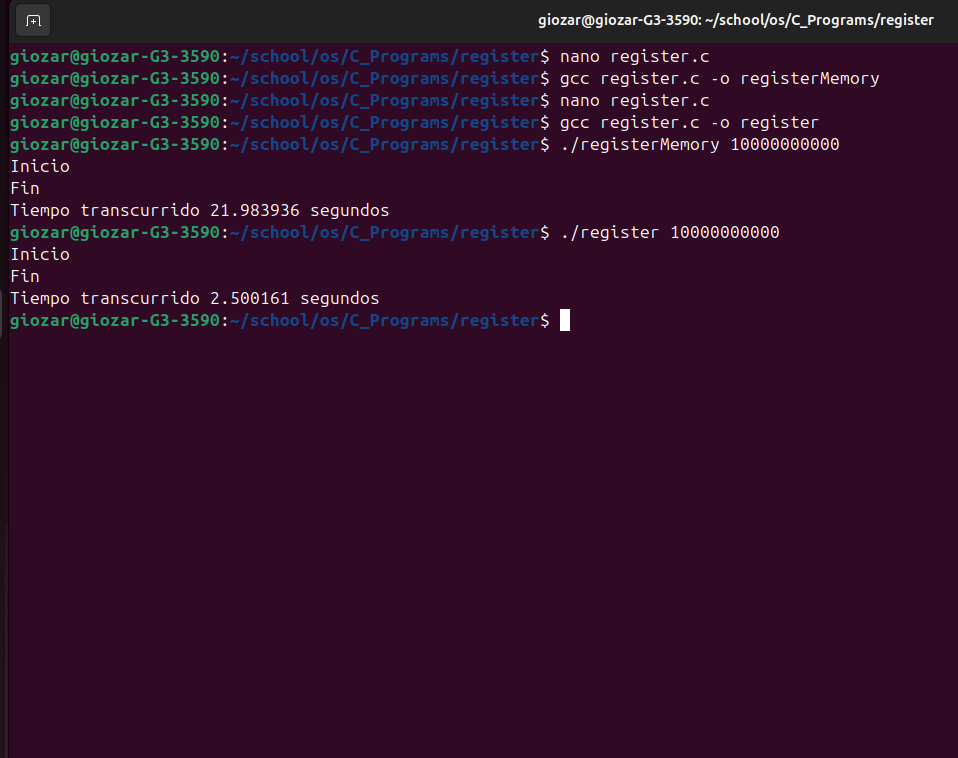

# Proyecto: Ejecución de Ciclo For con Número Máximo de Iteraciones

## Descripción

Este proyecto contiene un programa en C que ejecuta un ciclo `for` con un número máximo de iteraciones definido por el usuario a través de la línea de comandos. El propósito principal es medir el tiempo de ejecución del ciclo, permitiendo la comparación de la eficiencia del programa al utilizar diferentes optimizaciones, como el uso de la palabra clave `register` para almacenar variables en registros de la CPU.

## Estructura del Proyecto

El proyecto consta de un solo archivo fuente:

- `register.c`: Implementa la lógica principal del programa.

## Requisitos Previos

Para compilar y ejecutar el programa, necesitarás tener instalado un compilador de C, como `gcc`. Además, es necesario contar con un entorno de desarrollo compatible con C, como un sistema Unix (Linux, macOS) o un entorno como MinGW en Windows.

## Compilación

Para compilar el programa, abre una terminal y navega al directorio donde se encuentra el archivo `register.c`. Luego, ejecuta el siguiente comando:

```bash
gcc register.c -o <nombreDeArchivo>

## Ejecución
./<nombreDeArchivo> <numero_de_iteraciones>

## Capturas
A continuación se muestra una captura de pantalla del programa en ejecución:

  

  
